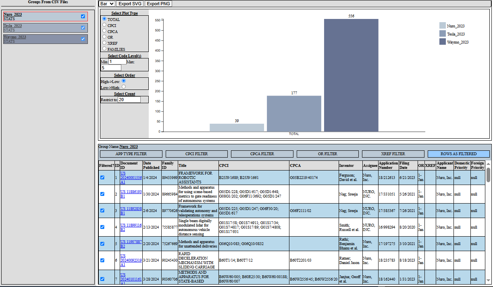

# PPSPLOT
Informal tools demonstrating ways to quickly plot Patent Public Search CSV results

Ages ago, I did a [law review](https://scholarship.kentlaw.iit.edu/ckjip/vol18/iss3/2/) on the importance of regularly comparing competitor leverage to understand patent value.  It’s also necessary to perform such monitoring if you plan on filing post-grant challenges in a timely manner (e.g., consider the Fintiv factors and the consequences if you file late).

Rather than work with the USPTO’s API or Bulk Data, it’s often more accessible for folks to do these reviews with the USPTO's [Patent Public Search (PPS) system](https://www.uspto.gov/patents/search/patent-public-search).

Unfortunately, PPS just outputs search results in raw CSV files, which isn’t very visually satisfying and makes it difficult to do a quick, off-the-cuff review.  It certainly makes it difficult to easily compare holdings.

Thus, this repository is a “proof of concept” demonstrating how easily you can (and probably should) create your own tool to convert such results into a visual representation (as well as consolidate into a JSON pickle, SQL database, etc.).

For example, let’s say you want to compare recent publications for Waymo, Tesla, and Nuro after 2023.  In PPS, that’s (taking a naïve, superficial approach - in a real analysis, you'd need to include holding companies, etc.):

* (@py>"2023") and ("Waymo").AANM.
* (@py>"2023") and ("Tesla").AANM.
* (@py>"2023") and ("Nuro").AANM.

I’ve exported and included those results (as of 06/29/2025) into the “./repo_csvs” of this repository:

* Nuro_2023.csv
* Tesla_2023.csv
* Waymo_2023.csv

In this demonstration, all I’ve done is:

1)	Consolidated CPC and Design codes into a convenient little sqlite database from:
  - a.	https://www.cooperativepatentclassification.org/cpcSchemeAndDefinitions/bulk
  - b.	https://www.uspto.gov/web/patents/classification/uspcd*/schedd*.htm 
2)	Use Python to read the CSVs into JSON, consolidate with the code data, and present in a browser interface via eel, wherein D3.js is then used to present pretty visualizations based upon filter selections
3)	Provide some generic SVG and PNG export code you can export the results.

In short, per the below image:
* The left-most column lists groups based upon the CSV files in csv_repo;
* The top-right region shows the current plot (one of line or bar) with corresponding display parameters; and
* the bottom-right region shows the currently selected CSV file from the left column, with a variety of filters for isolating results of interest.

For example, changing to the bar plot view and the "raw rows" filter produces the following view:

You certainly don't have to arrange things this way, it's just what I've found convenient.  This took me ~1 week of effort, so imagine what you can do if you put some real time into it for your organization.  Consider, e.g., integrating with other databases and review processes.

As this is just a quick, perfunctory demo you certainly shouldn't rely upon the code in its original form (I always sanity check and verify manually).  

(C) 2025 James Skelley
GNU AFFERO GENERAL PUBLIC LICENSE (with disclaimer addition)

See top-level LICENSE file for terms.

For clarity, in accordance with Item 16 of the AGPL, THIS SOFTWARE IS PROVIDED 
BY THE COPYRIGHT HOLDERS AND CONTRIBUTORS "AS IS" AND ANY EXPRESS OR IMPLIED WARRANTIES, 
INCLUDING, BUT NOT LIMITED TO, THE IMPLIED WARRANTIES OF MERCHANTABILITY AND FITNESS 
FOR A PARTICULAR PURPOSE ARE DISCLAIMED. IN NO EVENT SHALL THE COPYRIGHT OWNER OR 
CONTRIBUTORS BE LIABLE FOR ANY DIRECT, INDIRECT, INCIDENTAL, SPECIAL, EXEMPLARY,
OR CONSEQUENTIAL DAMAGES (INCLUDING, BUT NOT LIMITED TO, PROCUREMENT OF SUBSTITUTE 
GOODS OR SERVICES; LOSS OF USE, DATA, OR PROFITS; OR BUSINESS INTERRUPTION) 
HOWEVER CAUSED AND ON ANY THEORY OF LIABILITY, WHETHER IN CONTRACT, STRICT LIABILITY, OR TORT
(INCLUDING NEGLIGENCE OR OTHERWISE) ARISING IN ANY WAY OUT OF THE USE OF THIS
SOFTWARE, EVEN IF ADVISED OF THE POSSIBILITY OF SUCH DAMAGE.

